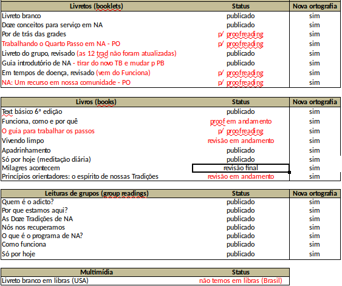
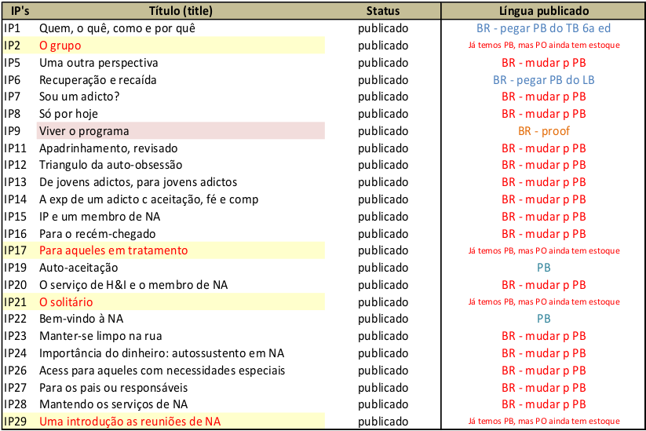
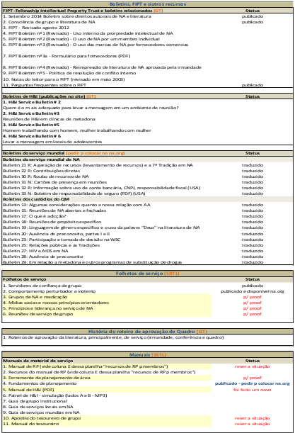

# Resumo SRTL Região Brasilsul:

Neste último período do SRTL da Região Brasil sul foi bem produtivo, apesar de nos meses de Fevereiro, Março e metade Abril,
nas reuniões presenciais não ter sido realizado nenhuma revisão de literatura por falta de servidor. Nestes meses fiquei sozinho nas reuniões.

Após a metade de Abril, companheiros voltaram a servir em Curitiba e as revisões foram retomadas. E conseguimos finalizar
o livreto do quarto passo.

A próxima reunião do subcomitê será dia 19/06/17 – 20:00, sendo que agora as reuniões acontecem a cada 14 dias alternadamente
entre o CSA Para-NA e o CSA Novos Caminhos. As reuniões em Maringá-PR no CSA PR44, foram encerradas por falta de servidores, portanto o coordenador do SRTL não relaizará mais neste CSA reuniões presenciais.

A próxima literatura revisada pelo SRTL será a Tradição 2 do novo livro "Guiding Principles: The spirit of our traditions" 

A próxima Conferência Nacional de Literatura será nos dias 19 e 20/08/17 em Fortaleza-CE. Todos SRTL's do Brasil estarão lá. Esse ano acontecerá a troca dos servidores da mesa.

Gostaria de deixar registrado que recebei um convite para ir para a Finlandia finalizar meu mestrado a partir do dia 15 de setembro de 2017 e estarei mais ausente por um período de 80 dias. Porém continuarei a participar das reuniões em Curitiba-PR via videconferência. Apenas não estarei presente na próxima reunião presencial da região em que o SRTL será representado pelo seu vice-coordenador, o companheiro Daniel.

## Resumo do calendário de reuniões presenciais do último período

# Resumo Status das literaturas de NA no Brasil

## Literaturas de Recuperação

## Folhetos de Informação ao Público

## Literaturas de serviço

