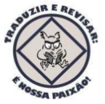
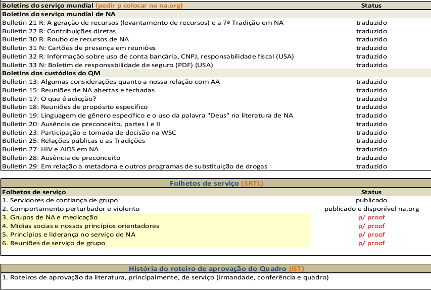

# Resumo SRTL Região Brasilsul:

	Neste último período do SRTL da Região Brasil sul manteve ativo e produtivo participando das primeiras revisões do novo livro de Tradições, que teve seu nome definido na última Conferência Nacional de Literatura de NA em Fortaleza-CE, como “Princípios orientadores: o espírito de nossas tradições ”. Além de revisamos as Tradições 2, 4, 10 no ano de 2017, este ano (2018), retomamos as atividades com a revisão da Tradição 11 e até o dia 26/02/2018, que foi nossa última reunião, ainda estávamos revisando seu conteúdo, que provavelmente será finalizado na próxima reunião.
	Como já mencionado no relatório anterior do SRTL, foi a escolhido o local da próxima conferência nacional de literatura de NA. Será em Curitiba-PR nos dias 18 e 19 de agosto de 2018. O cartaz já está pronto para divulgação do evento. 
	

	As reuniões presenciais do SRTL da região Brasil sul, continuam acontecendo nos CSA’s Novos Caminhos e PARA-NA, ambos em Curitiba-PR de 14 a 14 dias nas segundas-feiras. Quando ela é realizada no CSA PARA-NA elas mudaram paras as 19:00 (devido pedido do Subcomitê de eventos que solicitou o uso da sala neses dias) as 20:00 no CSA Novos Caminhos sem alterações.
	As reuniões no ano de 2018, voltaram a ser coordenadas pelo coordenador do SRTL Brasilsul, pois este voltou da Finlândia e está residindo novamente em Curitiba-PR.
	Desde o início do ano, o encargo de secretáriodo SRTL está em aberto.

#	Abaixo calendário das reuniões do SRTL no primeiro semestre de 2018:

# Resumo Status das literaturas de NA no Brasil

## Literaturas de Recuperação

## Folhetos de Informação ao Público

## Literaturas de serviço

## Relatório do coorenador nacional do SRTL

[Relatório Nacional](link/Nacional.pdf)
