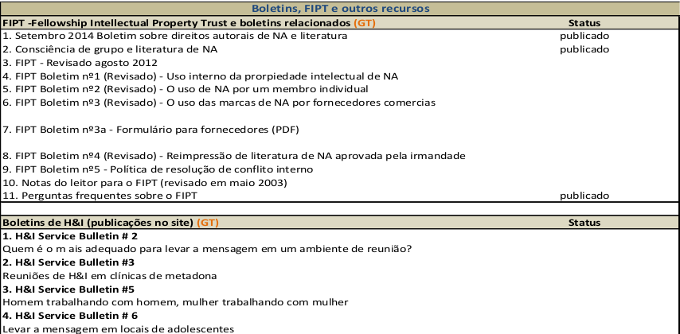
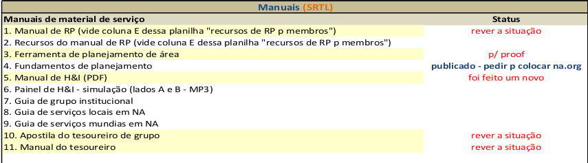
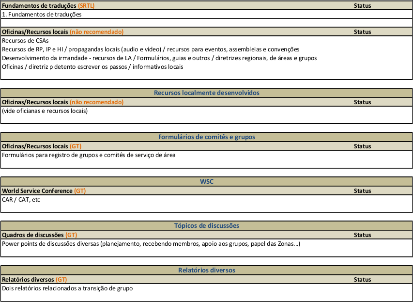

# Resumo SRTL Região Brasilsul:

	Neste último período do SRTL da Região Brasil sul manteve ativo e produtivo participando das primeiras revisões só novo livro de Tradições, que teve seu nome definido na última Conferência Nacional de Liter	atura de NA em Fortaleza-CE, como “Princípios orientadores: o espírito de nossas tradições ”. Revisamos a Tradição 2 e atualmente estamos atuando na revisão da Tradição 4.
	
	Nesta conferência em Fortaleza-CE, também foi eleita a nova mesa da SRTL nacional. Michel de Porto Alegre-RS, foi eleito coordenador nacional e o vice-coordenador eleito foi o companheiro Lucas de São Paulo-SP.
	Outra decisão importante tomada nesta reunião em Fortaleza-CE, foi a escolha da próxima conferência nacional de literatura de NA, que será em Curitiba-PR nos dias 18 e 19 de agosto de 2018.
	
	As reuniões presenciais do SRTL da região Brasil sul, continuam acontecendo nos CSA’s Novos Caminhos e PARA-NA, ambos em Curitiba-PR de 14 a 14 dias nas segundas-feiras as 20:00, com coordenação de nosso novo secretário, companheiro Tiago C. No período em que o coordenador, do SRTL da região Brasil sul, estará ausente devido a uma viagem ao exterior por motivos de estudos, as reuniões continuam sendo coordenadas pelo companheiro Tiago C.

O SRTL da nossa região será, representado na reunião regional, pelo vice-coordenador, o companheiro Daniel.

**Mais detalhes sobre a última conferência nacional de literatura de NA, que foi realizada em Fortaleza-CE nos dia
19 e 20 de Agosto, podem ser encontrados no link abaixo.**

(https://srtlcsrbs.github.io/SRTL/report/Conferência_Fortaleza.pdf)

# Resumo Status das literaturas de NA no Brasil

## Literaturas de Recuperação

## Folhetos de Informação ao Público

## Literaturas de serviço

